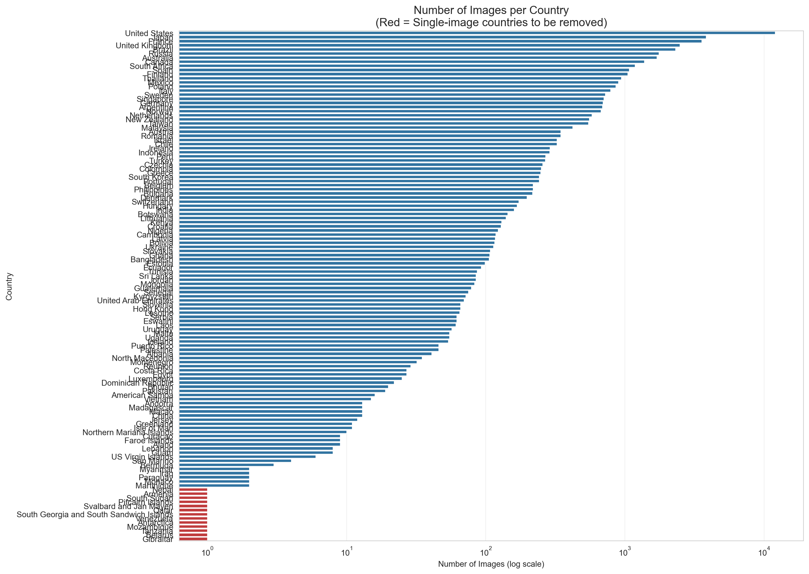
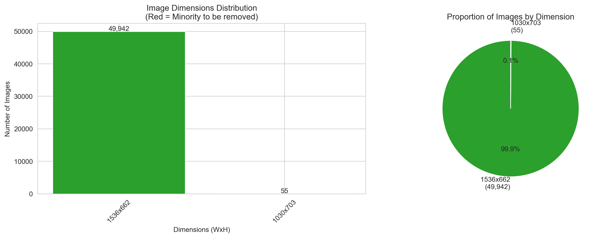
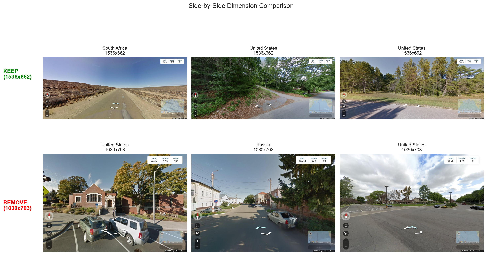
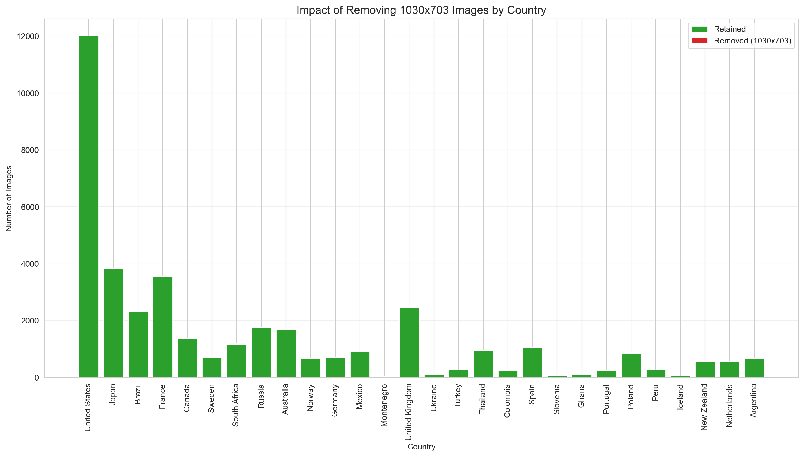

# GeoGuessr Dataset EDA Summary

## Overview

This EDA analyzes the GeoGuessr 50k image dataset to justify two data cleaning decisions:

1. **Removing single-image countries** – Countries with only one image provide no learning signal
2. **Removing minority dimension images (1030x703)** – Standardizing to a single image dimension for consistency

---

## 1. Class Distribution Analysis

The dataset exhibits a **severe class imbalance** with a power-law distribution:

- **Total images:** 49,997
- **Total countries:** 124
- **Top countries** (US, Japan, France, UK, Brazil) contain thousands of images
- **Many countries** have fewer than 10 images total
- **13 countries have only 1 image**, making them impossible to learn

_Bar chart showing the number of images per country. Single-image countries are highlighted in red._

### Single-Image Countries (13 total)

| Country                                  | Images |
| ---------------------------------------- | ------ |
| Nepal                                    | 1      |
| Armenia                                  | 1      |
| South Sudan                              | 1      |
| Pitcairn Islands                         | 1      |
| Svalbard and Jan Mayen                   | 1      |
| Qatar                                    | 1      |
| South Georgia and South Sandwich Islands | 1      |
| Venezuela                                | 1      |
| Antarctica                               | 1      |
| Mozambique                               | 1      |
| Tanzania                                 | 1      |
| Belarus                                  | 1      |
| Gibraltar                                | 1      |

These countries should be removed because:

- No train/val split is possible
- Model cannot learn generalizable features from a single example
- These contribute noise rather than signal

_Visual display of all 13 single-image countries showing the actual images that would be removed._

---

## 2. Image Dimensions Analysis

The dataset contains **two image dimensions**:

| Dimension | Count  | Percentage |
| --------- | ------ | ---------- |
| 1536x662  | 49,942 | 99.89%     |
| 1030x703  | 55     | 0.11%      |

_Left: Bar chart of dimension counts. Right: Pie chart showing the proportion of each dimension._

### Justification for Removing 1030x703 Images

- **Inconsistent input size** complicates model architecture
- **Only 55 images** (0.11% of dataset) – minimal data loss
- **Different aspect ratio** (1536x662 = 2.32 vs 1030x703 = 1.47)
- Standardizing dimensions simplifies preprocessing pipeline

_Side-by-side visual comparison of the two image dimensions showing the difference in size and aspect ratio._

### Per-Country Impact

_Stacked bar chart showing which countries are affected by removing the minority dimension images._

**The impact is negligible.** With only 55 images (0.11%) being removed across all affected countries, the red "removed" portion is barely visible in the stacked bar chart. Most countries lose at most 1-2 images, which has virtually no effect on training data availability. This confirms that removing the minority dimension is a safe cleaning step with minimal downside.

---

## 3. Combined Cleaning Impact

| Metric          | Before | After      |
| --------------- | ------ | ---------- |
| Total images    | 49,997 | 49,929     |
| Total countries | 124    | 111        |
| Images removed  | -      | 68 (0.14%) |

After applying both cleaning steps:

- Remove all 13 single-image countries (13 images)
- Remove all 1030x703 images (55 images)

The final dataset will have:

- 49,929 images (99.86% retained)
- 111 countries (removing impossible-to-learn classes)
- Consistent 1536x662 image dimensions throughout

---

## Recommendation

**Apply both data cleaning steps before training:**

1. Filter out countries with only 1 image (removes 13 countries, 13 images)
2. Filter out images with 1030x703 dimensions (removes 55 images)

This results in a cleaner, more learnable dataset with consistent characteristics and minimal data loss.
